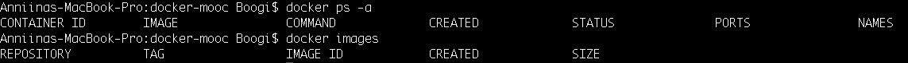
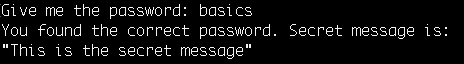

# Part 1

## 1.1 Getting started

*Docker ps -a* outputs:

```console
CONTAINER ID        IMAGE               COMMAND                  CREATED             STATUS                      PORTS               NAMES
89f61703f3be        nginx               "nginx -g 'daemon of…"   52 seconds ago      Exited (0) 18 seconds ago                       hopeful_jepsen
e57ad8d1f355        nginx               "nginx -g 'daemon of…"   54 seconds ago      Exited (0) 6 seconds ago                        angry_heyrovsky
302b3a81bf8d        nginx               "nginx -g 'daemon of…"   56 seconds ago      Up 54 seconds               80/tcp              unruffled_gates
8cf1c86578e6        nginx               "nginx -g 'daemon of…"   6 minutes ago       Exited (0) 5 minutes ago                        cool_gauss
```

Screenshot of the output: 
## 1.2 Cleanup

*Docker ps -a* outputs: 

```console
CONTAINER ID        IMAGE               COMMAND             CREATED             STATUS              PORTS               NAMES

```


*Docker images* outputs:

```console
REPOSITORY          TAG                 IMAGE ID            CREATED             SIZE
```

Sreenshots of both outputs: 

## 1.3 Hello Docker Hub

Command executed for completing the exercise (without output of downloading the image):
```console
$ docker run -it devopsdockeruh/pull_exercise

Give me the password: basics
You found the correct password. Secret message is:
"This is the secret message"
```


Screenshot: 



## 1.4 

Commands (without outputs) executed to complete the exercise:
```console
$ docker run -d devopsdockeruh/exec_bash_exercise
$ docker container ls
$ docker exec -it beautiful_margulis bash
root@934a6179c912:/usr/app# tail -f ./logs.txt

```

The output of the last command:
```console
Secret message is:
"Docker is easy"
Sat, 18 Apr 2020 14:26:20 GMT
Sat, 18 Apr 2020 14:26:23 GMT
Sat, 18 Apr 2020 14:26:26 GMT
Sat, 18 Apr 2020 14:26:29 GMT
read escape sequence
```

And cleaning up the container (because I didn't use --rm flag when running it):
```console
$ docker container ls

CONTAINER ID        IMAGE                               COMMAND             CREATED             STATUS              PORTS               NAMES
934a6179c912        devopsdockeruh/exec_bash_exercise   "node index"        6 minutes ago       Up 6 minutes                            beautiful_margulis

$ docker stop beautiful_margulis

$ docker rm beautiful_margulis

$ docker ps -a
CONTAINER ID        IMAGE               COMMAND             CREATED             STATUS              PORTS               NAMES
```

## 1.5 

Command run in terminal tab 1:
```console
$ docker run -it --name curl-helsinki ubuntu:16.04 sh -c 'echo "Input website:"; read website; echo "Searching.."; sleep 1; curl http://$website;'
Input website:
```

Command run in terminal tab 2:
```console
$ docker attach --sig-proxy=false curl-helsinki
read escape sequence

$ docker exec -it curl-helsinki bash
root@8478dbdf4a10:/# apt install curl
```

Then again in terminal tab 1:
```console
helsinki.fi
Searching..
<!DOCTYPE HTML PUBLIC "-//IETF//DTD HTML 2.0//EN">
<html><head>
<title>301 Moved Permanently</title>
</head><body>
<h1>Moved Permanently</h1>
<p>The document has moved <a href="http://www.helsinki.fi/">here</a>.</p>
</body></html>
```

## 1.6 

Dockerfile produced can be [found here](projects/1_6/Dockerfile).

And the commands that were used to build and run it (executed in /projects/1_6/:
```console
$ docker build -t docker-clock .
$ docker run docker-clock
```

## 1.7

Dockerfile can be [found here](projects/1_7/Dockerfile). 

The commands that were used to build and run the container (in /projects/1_7/):
```console
$ docker build -t curler .
$ docker run -it curler
```

## 1.8

First we need to create the logs.txt file locally so that we can mount file to file instead of directory to directory (to avoid overwriting other files in dir):
``` console
$ touch logs.txt 
```


Then we run the following command:
```console
$ docker pull devopsdockeruh/first_volume_exercise

$ docker run -v "$(pwd)"/logs.txt:/usr/app/logs.txt devopsdockeruh/first_volume_exercise
```

## 1.9

Commands run for running the container with port mapping:

```console
$ docker pull devopsdockeruh/ports_exercise

$ docker run -d -p 80:80 devopsdockeruh/ports_exercise
```

## 1.10

After cloning [this repo](https://github.com/docker-hy/frontend-example-docker) it was dockerized with Dockerfile which can be found [here](projects/1_10/Dockefile).


