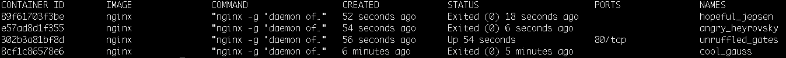

# Part 1

## 1.1 Getting started

*Docker ps -a* outputs:

```
CONTAINER ID        IMAGE               COMMAND                  CREATED             STATUS                      PORTS               NAMES
89f61703f3be        nginx               "nginx -g 'daemon of…"   52 seconds ago      Exited (0) 18 seconds ago                       hopeful_jepsen
e57ad8d1f355        nginx               "nginx -g 'daemon of…"   54 seconds ago      Exited (0) 6 seconds ago                        angry_heyrovsky
302b3a81bf8d        nginx               "nginx -g 'daemon of…"   56 seconds ago      Up 54 seconds               80/tcp              unruffled_gates
8cf1c86578e6        nginx               "nginx -g 'daemon of…"   6 minutes ago       Exited (0) 5 minutes ago                        cool_gauss
```

Screenshot of the output: 
## 1.2 Cleanup

*Docker ps -a* outputs: 

```
CONTAINER ID        IMAGE               COMMAND             CREATED             STATUS              PORTS               NAMES

```


*Docker images* outputs:

```
REPOSITORY          TAG                 IMAGE ID            CREATED             SIZE
```

Sreenshots of both outputs: 